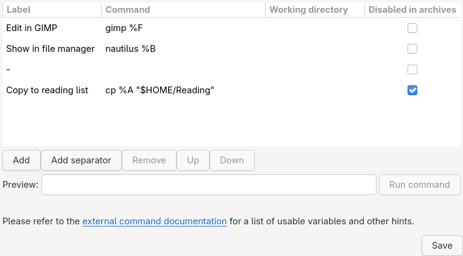

# External commands

Run programs of your choosing on the open file: an image editor for a page, a file manager at the book, a script of your own.

- "File → Open with" lists them; its "Edit commands" sets them up.
- Keys 1 to 9 run the first nine.

## Add and edit commands

- "Add" adds a command; "Add separator" a divider line in the menu.
- "Remove", "Up" and "Down" act on the selected row; rows can also be dragged.
- "Preview" shows the selected command as it would run on the open page, and says so if the program or working directory is missing.
- "Run command" runs it. "Save" keeps the list; closing with unsaved changes asks first.

Each command has four fields:

- *Label*: its name in the menu.
- *Command*: the program and its arguments, separated by spaces. Quote an argument with spaces. The variables below stand for the open file; environment variables such as `$HOME` are expanded too.
- *Working directory*: where the command runs, written the same way. Empty: where MComix was started.
- *Disabled in archives*: not run while an archive is open, since its pages are temporary files MComix deletes on close.

A path a variable puts in stays in one argument, spaces and all: it needs no quotes.

Examples:

Label | Command | Disabled in archives
------|---------|---------------------
Edit in GIMP | `gimp %F` | Yes: edits to an unpacked page would be lost.
Show the book's folder | `xdg-open %S` (Linux), `explorer %S` (Windows) | No

## Variables

Each variable in the command and working directory is replaced by the path or name it stands for.

### Image

With an archive open, these name the temporary files the pages were unpacked to.

Variable | Meaning | Example
---------|---------|--------
%F | Path of the open image | /home/user/Downloads/cats.jpg
%f | Name of the open image | cats.jpg
%D | Path of the image's directory | /home/user/Downloads
%d | Name of the image's directory | Downloads

### Archive

Only while an archive is open.

Variable | Meaning | Example
---------|---------|--------
%A | Path of the open archive | /home/user/comic-2012.zip
%a | Name of the open archive | comic-2012.zip
%n | Name of the open archive without its extension | comic-2012
%C | Path of the archive's directory | /home/user
%c | Name of the archive's directory | user

### Book and shelf

The archive where one is open, the directory of images otherwise. B is for "book", S for "shelf".

Variable | Meaning | Directory example | Archive example
---------|---------|-------------------|----------------
%B | Path of the image's directory, or of the archive | /home/user/Downloads | /home/user/comic-2012.zip
%b | Name of the image's directory, or of the archive | Downloads | comic-2012.zip
%S | Path of the directory holding that directory or archive | /home/user | /home/user
%s | Name of the directory holding that directory or archive | user | user

### Other

Variable | Meaning | Example
---------|---------|--------
%/ | Directory separator: backslash on Windows, slash elsewhere | /
%" | A quotation mark | "
%% | A per cent sign | %
