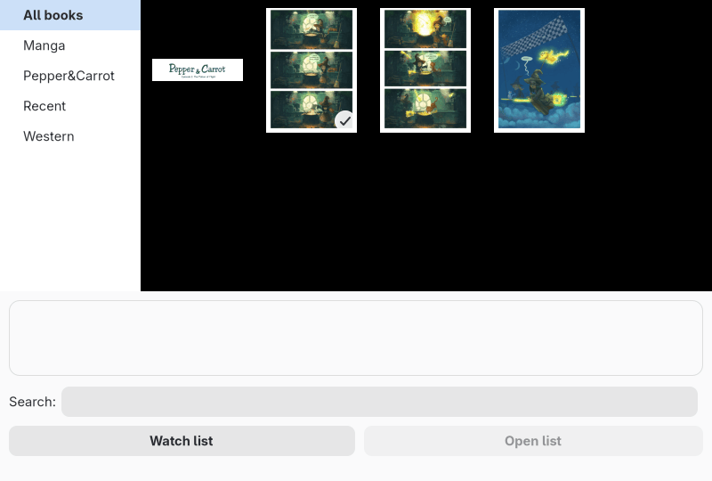

# Library

The library, CTRL+L, files books in collections and shows their covers.
A book is an archive in any format MComix opens; folders cannot be added.

One cover is from "The Potion of Flight", episode 1 of [Pepper&Carrot](https://www.peppercarrot.com/) by David Revoy, [CC BY 4.0](https://creativecommons.org/licenses/by/4.0/), scaled down.

## Collections

- Collections are on the left; the selected one's books on the right, with those of the collections under it.
- "All books" holds every book.
- Drag a collection onto another to file it there.
- Drag books onto a collection to move them there from the collection on show; from "All books" they are added and stay where they were.
- "Recent" holds the books that are read, not books dragged onto it.
- "Add..." and books dropped from a file manager go into the collection on show; under "All books" or "Recent" they join no collection.
- Right-clicking a collection offers "New", "Add...", "Rename", "Duplicate", "Clean up" and "Remove".
  - "Duplicate" makes a copy beside it, holding every book it shows.
  - "Clean up" drops books whose files are gone.
  - "Remove" keeps the books in the library, and moves the collections under it to the top.

## Books

- The search field shows the books whose name or path contains its text, case aside, once Enter is pressed.
- A book read to its last page has a tick on its cover.
- The line under the covers gives the selected book's folder, size, page count, and the page it was left on or when it was finished.
- Right-clicking the books offers "Open", "Open without closing library", "Add...", "Clean up", "Copy", and three ways to take them out:
  - "Remove from this collection".
  - "Remove from the library".
  - "Remove and move to the trash": the only one that touches the files. They can be restored from the trash. Where the trash would refuse one, MComix asks to delete it permanently instead. It also takes them out of the recent files and asks about their bookmarks.
- "Copy" puts a single book's path and cover on the clipboard.
- "Sort" orders by name, full path, file size or date added; "Cover size" sets how large covers are drawn.
- A middle click on a cover starts a second MComix on that book.
- A RAR book in volumes is added as its first volume; the others are left out.
- An encrypted book is added without asking its password. Its cover is a padlock; the password is asked when it is opened.

## Watched folders

- "Watch list", at the bottom of the library window, names folders to look in for new books, each with its collection and whether subfolders are searched.
- "Scan now" searches at once; closing an edited list searches too.
- With "Automatically scan for new books when library is opened", the search runs whenever the library opens.

## Recent books

- While "Store information about recently opened files" is "Always", every archive opened joins the "Recent" collection with the page it was left at.
- That page is remembered by its picture, so re-sorting the archive does not move it.
- "Never" stops this, and offers to clear what is kept.
