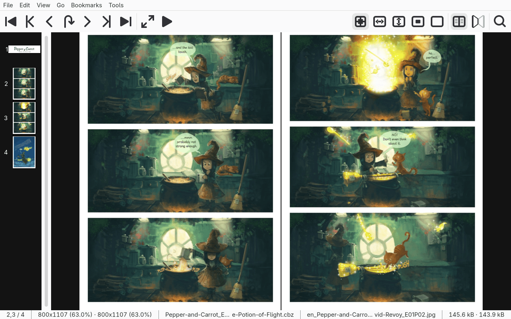

# Reading

Shown: "The Potion of Flight", episode 1 of [Pepper&Carrot](https://www.peppercarrot.com/) by David Revoy, [CC BY 4.0](https://creativecommons.org/licenses/by/4.0/), scaled down.

## The window

- Menu bar and toolbar at the top, page thumbnails on the left, the page in the middle, status bar at the bottom.
- "View → Toolbars" shows or hides the menubar, toolbar, statusbar, scrollbars and thumbnails.
- "Hide all", in the same menu or the I key, puts them all away at once.
- Fullscreen, the F key, hides them too while "Automatically hide all toolbars in fullscreen" is set.
- Escape leaves fullscreen, and so does "Leave fullscreen" at the top of the right-click menu.
- The arrow keys scroll the page; PageDown and PageUp turn it.
- Space and the mouse wheel scroll in reading order: across, down, across again, then to the next page.
- [Keyboard and mouse](shortcuts.md) lists every binding.
- L, or the middle mouse button, shows a magnifying lens.
- "File → Properties" describes the page and its archive, with series, issue, title and writer from a ComicInfo.xml.
- "Move to", in the page's right-click menu, moves the open file or archive to another folder.
  Its place in the library, last page, bookmarks and recent-files entry follow it.

## Opening books

- CTRL+O opens a file chooser; dropping files on the page opens them too.
- An archive, PDF or AZW3 file opens as one book. RAR, 7z, LHA and PDF need a helper: see [Install](install.md#requirements).
- An image opens with every image in its folder; a folder opens its images.
- Several files picked at once open as one book of just those.
- CTRL+SHIFT+N and CTRL+SHIFT+P open the next and previous archive in the folder. Past its last archive they go on into the next folder, as "Automatically open next directory" in the [preferences](preferences.md) describes, while that is on.
- CTRL+N and CTRL+P open the next and previous folder with a book, the same way.
- CTRL+SHIFT+R reloads the book. If its file has been deleted, the next one in its folder opens instead, or the last one.
- An encrypted archive asks for its password.
- A RAR book in volumes (name.part1.rar, name.part2.rar, …) is read from its first volume.
  Opening any other volume opens the whole book from name.part1.rar, if it is there.

The file chooser's preview shows:

- name and size, then a picture's size in pixels, or a book's page count and archive type;
- for a book whose file list is encrypted, its type alone; no password is asked;
- for an encrypted book, a padlock; for a file that will not load, the picture MComix shows for one.

## Fit modes

Mode | Key | What it does
-----|-----|-------------
Best fit | B | Scales a page down to fit the window.
Fit to width | W | Scales a page down to the window's width; a taller page scrolls up and down.
Fit to height | H | Scales a page down to the window's height; a wider page scrolls sideways.
Fit to size | S | Scales pages to the sizes set in the preferences: one for wide pages such as spreads, one for the rest. By default 3790x960 and 1450x1800.
Manual zoom | A | No scaling.

No mode scales a small page up unless "View → Stretch small images" is on.

## Double page and manga mode

- Double page mode, the D key, shows two pages side by side, so a spread reads as one.
- The cover and pages wider than tall are shown alone, unless the preferences say otherwise.
- "View → Title page alone" turns the cover's half of that on or off, for a book that pairs wrongly with it. Its key can be set under Shortcuts.
- Pages turn two at a time; turning back shows the same pairs as forward.
- CTRL with PageDown or PageUp turns one page, which shifts the pairing by one.
- Manga mode, the M key, lays out and scrolls pages from right to left.

## Slideshow

- CTRL+S starts it. It works like pressing the Down arrow at intervals.
- By default it scrolls 50 pixels every three seconds.
- A delay of 0.05 seconds with a step of 1 pixel scrolls smoothly. Both are preferences.

## Enhancing the image

"Tools → Enhance image...", the E key, sets brightness, contrast, saturation and sharpness, beside a histogram of the page.

- "Automatically adjust contrast" stretches each colour band to the page.
- "Invert image colors", also CTRL+I, shows the negative.
- Changes show at once on the pages, thumbnails, magnifying lens and library covers, for every book, until MComix closes.
- "Reset" takes every enhancement off, without saving.
- "Save" keeps the values for the next start; "Revert" goes back to the saved ones; "OK" closes the dialog.
- CTRL+I is kept for the next start straight away.

## Rotating and flipping

"Tools → Transform image":

- Turns the page 90° clockwise (R), anticlockwise (SHIFT+R) or 180°, and flips it horizontally or vertically.
- In double page mode both pages turn together.
- The next page is shown upright again, unless "Keep transformation" (K) is on: then every page gets the same turn, also after a restart.
- "Auto-rotate image" turns every page taller than wide, or wider than tall, 90° either way, until set back to "Never".
  It goes by what is shown: two pages side by side count as one wide page. It adds to a turn given by hand.
- Images whose metadata, such as an Exif tag, says which way up they go are turned that way while "Automatically rotate images according to their metadata" is set.

## Recent files and bookmarks

- Picking an entry in "File → Recent" or the "Bookmarks" menu closes the book and opens the one picked.
- A bookmark in the open book only turns to its page, keeping pages picked out and the undo history.
- A bookmark finds its page by the page's file, wherever sorting the archive has put it.
- A middle click on an entry starts a second MComix on it, at the bookmark's page.
- CTRL+D adds a bookmark; CTRL+B edits them.
- "Bookmarks → Remove this book's bookmarks..." removes the open book's, after asking.

## Command line

- `mcomix book.cbz` opens a book; `mcomix --page 42 book.cbz` opens it at page 42.
- `-f`, `-d` and `-m` start in fullscreen, double page and manga mode; `-l` with the library open.
- `mcomix -W debug -o mcomix.log` writes a log: see [Troubleshooting](troubleshooting.md#logs).
- `mcomix --help` lists the other options.

## See also

- [Editing books](editing.md): rename, reorder and delete pages.
- [Library](library.md): collections of books.
- [External commands](external-commands.md): "File → Open with" runs your own programs on the open file.
